# Data Preprocessing and Feature Engineering

## Overview

After EDA and data cleaning, raw features must be transformed into a format the model can learn from, and new features must be constructed to capture behavioral patterns that individual columns cannot express alone.

**Pipeline order:**
```
Raw Data → Data Cleaning → EDA → Data Preprocessing → Feature Engineering → Modeling
```

| Step | Purpose |
|------|---------|
| Data Cleaning | Fix data quality issues (leakage removal, SMOTE recovery) |
| EDA | Understand distributions, correlations, and artifacts |
| **Data Preprocessing** | Encode clean features into numeric format |
| **Feature Engineering** | Create new features that capture joint patterns |

---

## Techniques and Algorithms Used

### Why No Standardization (Z-score / Min-Max Scaling)?

`StandardScaler` and `MinMaxScaler` are imported but **intentionally not applied**.

The three models used — **XGBoost**, **LightGBM**, and **Random Forest** — are all tree-based. Tree models work by finding the best split threshold on each feature:

```
Split: FAF_int < 1.5  →  left branch (less active)
                       →  right branch (more active)
```

This decision depends only on the **rank order** of values, not their absolute scale. Whether FAF_int = 3 or FAF_int = 300, the split logic is identical. Scaling would change the numbers but not the splits — so it has zero effect on tree model performance.

> Standardization is required for distance-based models (k-NN, SVM, logistic regression) and gradient-based models (neural networks). It is unnecessary and has no benefit for tree-based models.

---

### Techniques Summary

| Technique | Where Applied | Formula / Method |
|-----------|--------------|-----------------|
| **Column dropping** | Leakage removal | `df.drop(columns=["Weight","Height"])` |
| **Clipping** | SMOTE recovery | `df[col].clip(lo, hi)` |
| **Rounding** | SMOTE recovery | `.round().astype(int)` |
| **Binary encoding** | FAVC, SMOKE, SCC, family_history | `(df[col] == "yes").astype(int)` |
| **Ordinal encoding** | CAEC, CALC | `df[col].map({"no":0,"Sometimes":1,"Frequently":2,"Always":3})` |
| **One-hot encoding** | Gender, MTRANS | `pd.get_dummies(df, columns=[...])` |
| **Binning / Discretization** | age_group | `pd.cut(df["Age"], bins=[0,18,25,35,50,99])` |
| **Weighted linear combination** | caloric_risk | `NCP_int + CAEC_ord + 2×FAVC_bin` |
| **Component normalization** | health_score | Divide each component by its max (3) before averaging |
| **Rule-based encoding** | lifestyle_region, screen_activity, risk_quadrant | Conditional if-else logic |
| **Feature multiplication** | FAF_x_TUE | `FAF_int × TUE_int` |
| **Boolean flag** | transport_active | `df["MTRANS"].isin(["Walking","Bike"]).astype(int)` |
| **Spearman correlation** | Feature evaluation | See formula below |

---

### Spearman Rank Correlation — The Evaluation Metric for Features

**Why Spearman, not Pearson?**

Pearson correlation measures linear relationships between continuous variables. The obesity target (`NObeyesdad`) is an **ordinal categorical variable** — it has order (Insufficient < Normal < Overweight < Obese) but the gap between classes is not equal. Spearman correlation works on ranks, making it appropriate for ordinal targets.

**Formula:**

$$\rho = 1 - \frac{6 \sum d_i^2}{n(n^2 - 1)}$$

Where:
- $d_i$ = difference in rank between feature value and target value for observation $i$
- $n$ = number of observations
- $\rho \in [-1, +1]$

**Scale for behavioral features:**

| \|ρ\| range | Interpretation |
|------------|----------------|
| > 0.30 | Strong signal |
| 0.10 – 0.30 | Moderate signal |
| < 0.10 | Weak — may be noise |

**In code:**
```python
from scipy import stats
rho, p_value = stats.spearmanr(df["family_history_with_overweight_bin"], y_numeric)
# rho = +0.500, p_value ≈ 0 → very strong, statistically significant
```

---

### One-Hot Encoding — The Dummy Variable Trap

When applying `pd.get_dummies()` to a feature with K categories, it creates K binary columns. In theory, only K−1 are needed because the last column is perfectly predictable from the other K−1 (if all others are 0, the last must be 1). Including all K creates **multicollinearity**.

However, tree-based models are immune to multicollinearity — they select features by information gain, not by covariance. So keeping all K columns (including both `Gender_Male` and `Gender_Female`) is harmless and slightly more readable.

---

### Ordinal Encoding — Preserving Order Information

The mapping `{"no":0, "Sometimes":1, "Frequently":2, "Always":3}` encodes the **natural order** of consumption frequency. This is critical for CAEC and CALC because the model needs to understand that Always (3) > Frequently (2) > Sometimes (1) > no (0).

Alternative approaches considered:

| Approach | Problem | Decision |
|----------|---------|----------|
| One-hot encode CAEC | Loses the ordering information | ✗ Rejected |
| Treat as continuous (0–3) | Assumes equal spacing between levels | ✓ Accepted — reasonable approximation |
| Target encoding | Risk of leakage from target variable | ✗ Rejected |

---

### Binning — Converting Continuous Age to Ordinal

`pd.cut()` implements **equal-width binning** with manually defined breakpoints:

```python
pd.cut(df["Age"], bins=[0, 18, 25, 35, 50, 99], labels=[0, 1, 2, 3, 4])
```

The breakpoints are not arbitrary — they align with established biological life stage transitions:
- 18: end of adolescence / school period
- 25: peak metabolic rate (growth hormone decline begins)
- 35: notable hormonal shifts (testosterone/oestrogen changes)
- 50: post-menopausal / andropause onset

This is **domain-driven binning**, not automatic or quantile-based.

---

## Data Preprocessing

Preprocessing converts categorical text values into numbers that the model can compute with. Three encoding strategies are used depending on the nature of each feature.

---

### 3.1 Binary Encoding

**Why:**
Features like `family_history_with_overweight` store text values "yes" or "no". Machine learning models only understand numbers — they cannot compute with strings. Binary encoding converts yes → 1 and no → 0, preserving the meaning while making the feature usable.

**How:**
```python
df["family_history_with_overweight_bin"] = (df["family_history_with_overweight"] == "yes").astype(int)
df["FAVC_bin"]  = (df["FAVC"]  == "yes").astype(int)
df["SMOKE_bin"] = (df["SMOKE"] == "yes").astype(int)
df["SCC_bin"]   = (df["SCC"]   == "yes").astype(int)
```

**Features encoded:**

| Original Column | Encoded Column | 1 means | 0 means |
|----------------|----------------|---------|---------|
| `family_history_with_overweight` | `family_history_with_overweight_bin` | Has family history of obesity | No family history |
| `FAVC` | `FAVC_bin` | Frequently eats high-calorie food | Does not |
| `SMOKE` | `SMOKE_bin` | Currently smokes | Does not smoke |
| `SCC` | `SCC_bin` | Monitors caloric intake | Does not monitor |

**Example:**

| Person | family_history_with_overweight | family_history_with_overweight_bin |
|--------|-------------------------------|-----------------------------------|
| A | yes | 1 |
| B | no | 0 |

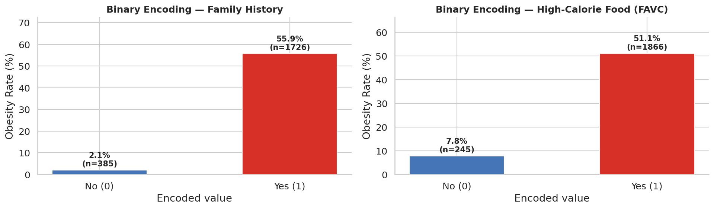

*Family history (1=yes) shows 55.9% obesity vs 2.1% for no history — a 54-point gap. This is the strongest single predictor in the dataset.*

---

### 3.2 Ordinal Encoding

**Why:**
`CAEC` (eating between meals) and `CALC` (alcohol consumption) are ordered categories — "Sometimes" is more frequent than "no" and less frequent than "Frequently". Ordinal encoding assigns integers that preserve this natural ranking. The model can then correctly understand that Always (3) represents more than Sometimes (1).

If we used one-hot encoding instead, we would lose the ordering information entirely. If we used arbitrary numbers (e.g., no=5, Sometimes=2), the model would learn a false order.

**How:**
```python
FREQ_MAP = {"no": 0, "Sometimes": 1, "Frequently": 2, "Always": 3}

df["CAEC_ord"] = df["CAEC"].map(FREQ_MAP).astype(int)
df["CALC_ord"] = df["CALC"].map(FREQ_MAP).astype(int)
```

**Mapping table:**

| Text Value | Encoded Value | CAEC Meaning | CALC Meaning |
|-----------|---------------|--------------|--------------|
| no | 0 | Never eats between meals | Never drinks alcohol |
| Sometimes | 1 | Occasionally snacks | Drinks occasionally |
| Frequently | 2 | Often snacks | Drinks regularly |
| Always | 3 | Constantly snacks | Drinks daily |

**Example — CAEC:**

| Person | CAEC (original) | CAEC_ord | Interpretation |
|--------|----------------|----------|----------------|
| A | no | 0 | Never snacks — lowest dietary risk from snacking |
| B | Sometimes | 1 | Light snacker |
| C | Frequently | 2 | Heavy snacker |
| D | Always | 3 | Constant snacker — highest risk |

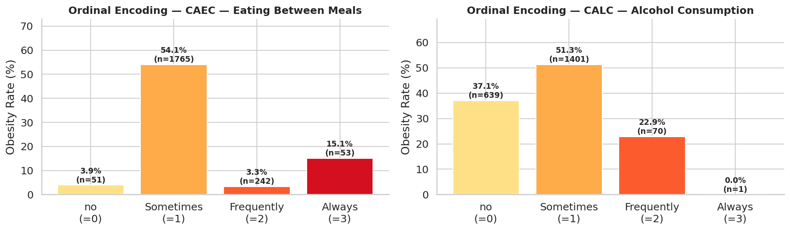

*Note: "Sometimes" appears highest due to SMOTE artifact (n=1,765, 84% of data). See EDA section for explanation.*

---

### 3.3 One-Hot Encoding

**Why:**
`Gender` and `MTRANS` are nominal categories — they have no natural ordering. "Automobile" is not greater or lesser than "Walking", they are simply different. If we assigned integers (Walking=1, Bike=2, Automobile=5), the model would incorrectly learn that Automobile > Walking numerically. One-hot encoding creates a separate binary column for each category value, avoiding any false ordering.

**How:**
```python
df = pd.get_dummies(df, columns=["Gender", "MTRANS"])
```

**Example — MTRANS (before and after):**

| Person | MTRANS (original) | MTRANS_Walking | MTRANS_Bike | MTRANS_Public_Transportation | MTRANS_Automobile | MTRANS_Motorbike |
|--------|-----------------|:--------------:|:-----------:|:----------------------------:|:-----------------:|:----------------:|
| A | Walking | 1 | 0 | 0 | 0 | 0 |
| B | Automobile | 0 | 0 | 0 | 1 | 0 |
| C | Public_Transportation | 0 | 0 | 1 | 0 | 0 |

Each person gets exactly one 1 and zeros everywhere else.

**Columns created:**

| Original Feature | One-Hot Columns Created |
|-----------------|------------------------|
| `Gender` | `Gender_Male`, `Gender_Female` |
| `MTRANS` | `MTRANS_Walking`, `MTRANS_Bike`, `MTRANS_Motorbike`, `MTRANS_Public_Transportation`, `MTRANS_Automobile` |

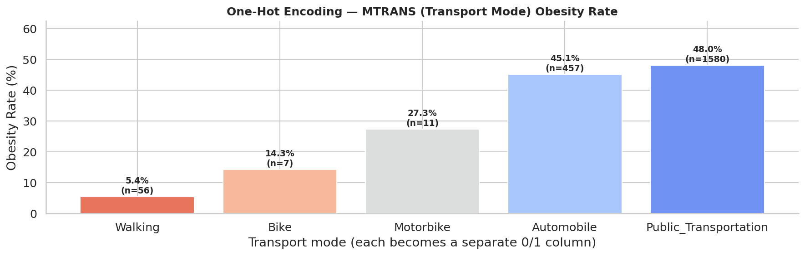

*Walking shows the lowest obesity rate (5.4%) but only n=56 people — interpret with caution due to small sample size.*

---

---

## Feature Engineering

Feature engineering creates new features that go beyond what individual raw columns can capture. The goal is to encode domain knowledge — behavioral patterns, lifestyle interactions, and clinical risk profiles — directly into the feature matrix so the model can learn from them more efficiently.

---

### 4.1 SMOTE Ordinal Recovery *(prerequisite step)*

Before engineering composites, the five ordinal survey columns must be recovered from SMOTE-interpolated floats back to valid integer survey ticks.

**Why:**
The original dataset was small. SMOTE generated synthetic rows by interpolating between neighbours, producing non-integer values like FCVC=2.784. These float values do not correspond to any real survey answer. Engineering composites from floats would carry this noise forward into every derived feature.

**How:**
```python
SMOTE_CLIPS = {"FCVC":(1,3), "NCP":(1,4), "CH2O":(1,3), "FAF":(0,3), "TUE":(0,2)}

for col, (lo, hi) in SMOTE_CLIPS.items():
    df[f"{col}_int"] = df[col].clip(lo, hi).round().astype(int)
```

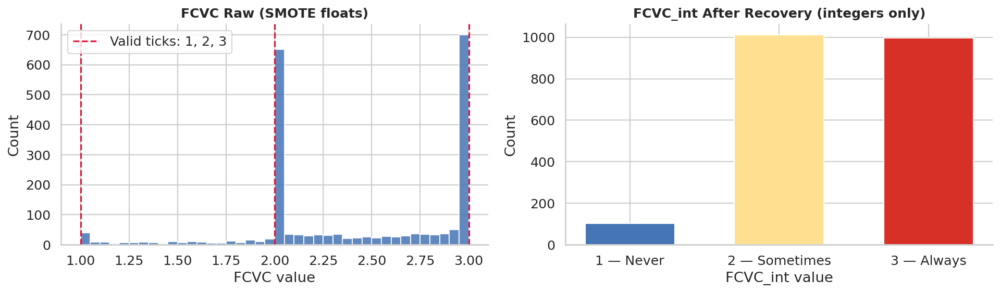

*Left: raw FCVC with continuous float values from SMOTE interpolation. Right: FCVC_int after clipping and rounding to valid survey ticks {1, 2, 3}.*

---

### 4.2 Age Group

**Why:**
`Age` is continuous (14–61 years) but the biological relationship with obesity is non-linear. A tree-based model splitting on raw Age would need many splits to capture the different metabolic regimes. Bucketing Age into meaningful life stages lets one split capture an entire phase of biological change.

**Formula:**
```python
df["age_group"] = pd.cut(df["Age"],
    bins=[0, 18, 25, 35, 50, 99],
    labels=[0, 1, 2, 3, 4],
    include_lowest=True
).astype(int)
```

**Stage definitions:**

| age_group | Age Range | Life Stage | Biological context |
|-----------|-----------|------------|--------------------|
| 0 | ≤ 18 | Teen | High metabolism, active through school, growth phase |
| 1 | 19–25 | Young Adult | Lifestyle habits forming, metabolic peak |
| 2 | 26–35 | Adult | Desk jobs emerging, less structured physical activity |
| 3 | 36–50 | Mid-Age | Metabolism declining ~5% per decade, hormonal shifts |
| 4 | > 50 | Senior | Sarcopenia, lowest metabolic rate, sleep quality declining |

**Example:**

| Person | Age | age_group | Stage |
|--------|-----|-----------|-------|
| A | 16 | 0 | Teen — high metabolism, naturally active |
| B | 22 | 1 | Young Adult — habits forming |
| C | 45 | 3 | Mid-Age — metabolic decline underway |

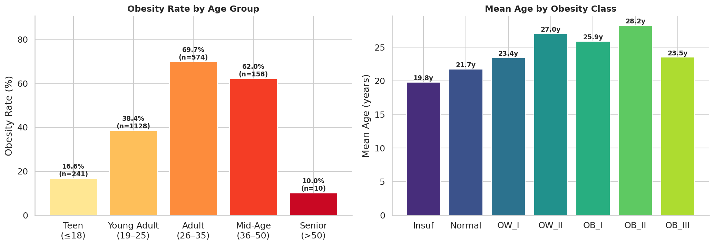

*Left: obesity rate rises sharply with age group. Right: OB_III mean age = 23.5y (dip at end) reveals severe early-onset obesity in young adults.*

---

### 4.3 Caloric Risk Score

**Why:**
NCP (number of meals), CAEC (snacking frequency), and FAVC (high-calorie food) each describe one dimension of dietary risk. A person who eats 4 meals/day AND constantly snacks AND eats junk food is far more at risk than someone with just one of those behaviors. A single composite score captures this cumulative dietary burden better than three separate weak features.

**Formula:**
```
caloric_risk = NCP_int + CAEC_ord + 2 × FAVC_bin
```

FAVC is weighted ×2 because it has the strongest individual Spearman ρ (+0.250) of the three components.

```python
df["caloric_risk"] = df["NCP_int"] + df["CAEC_ord"] + 2 * df["FAVC_bin"]
```

**Score range:** 1 (lowest risk) to 9 (highest risk)

**Example:**

| Person | NCP_int | CAEC_ord | FAVC_bin | caloric_risk | Profile |
|--------|---------|----------|----------|:------------:|---------|
| A | 3 | 0 | 0 (no junk) | **3** | Low risk — 3 meals, no snacking, clean food |
| B | 3 | 1 | 1 (junk) | **6** | Moderate — 3 meals, light snacking, eats junk |
| C | 4 | 3 | 1 (junk) | **9** | Highest — 4 meals, constant snacking, junk food |

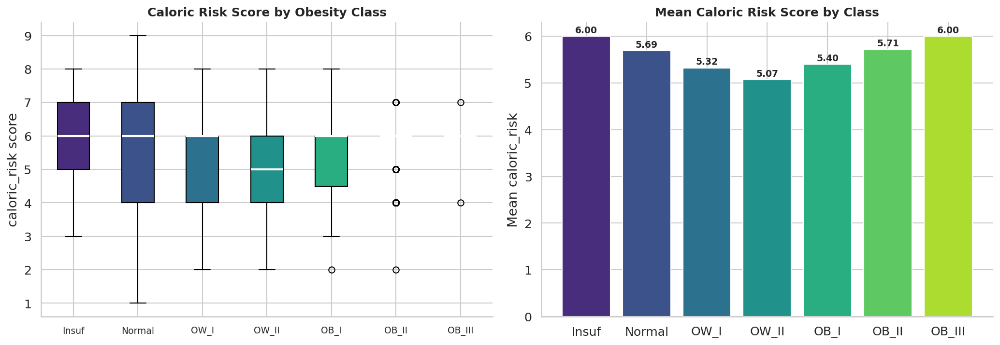

*Caloric risk score shows a rising trend across obesity classes. The composite separates classes more clearly than any single dietary feature alone.*

---

### 4.4 Health Score

**Why:**
FAF (exercise), CH2O (water intake), and FCVC (vegetables) each measure a different protective behavior. People who exercise regularly, drink enough water, and eat vegetables tend to exhibit all three habits together — a "bundle of healthy behaviors." Averaging the three captures this compound protective effect that no single feature expresses alone.

**Formula:**
```
health_score = FAF_int/3 + CH2O_int/3 + FCVC_int/3
```

Each component is divided by its maximum value (3) to bring it to a 0–1 scale before averaging.

```python
df["health_score"] = df["FAF_int"]/3 + df["CH2O_int"]/3 + df["FCVC_int"]/3
```

**Score range:** 0.0 (no protective behaviors) to 3.0 (maximum on all three)

**Example:**

| Person | FAF_int | CH2O_int | FCVC_int | health_score | Profile |
|--------|---------|----------|----------|:------------:|---------|
| A | 0 | 1 | 1 | **0.67** | Sedentary, barely drinks water, rare vegetables |
| B | 2 | 2 | 2 | **2.00** | Moderate on all three protective behaviors |
| C | 3 | 3 | 3 | **3.00** | Exercises daily, well-hydrated, always eats vegetables |

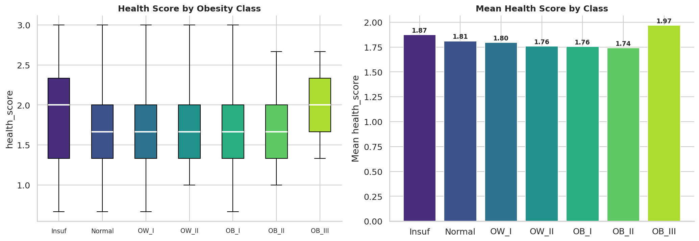

---

### 4.5 Lifestyle Region

**Why:**
Exercise (FAF) and diet quality (FAVC) interact in a non-linear way. A person who exercises but eats junk food partially compensates; a person who eats clean but never exercises also partially compensates. The most informative cases are the extremes: both good (Healthy) or both bad (High Risk). Neither FAF nor FAVC alone identifies these joint extremes. Lifestyle Region does it directly.

**Formula:**
```python
def lifestyle_region(row):
    if row["FAF_int"] >= 2 and row["FAVC_bin"] == 0:  return 0  # Healthy
    if row["FAF_int"] <  1 and row["FAVC_bin"] == 1:  return 2  # High Risk
    return 1                                                       # Moderate

df["lifestyle_region"] = df.apply(lifestyle_region, axis=1)
```

**Category definitions:**

| Value | Condition | Profile | Description |
|-------|-----------|---------|-------------|
| 0 | FAF ≥ 2 days/week AND FAVC = no | Healthy | Exercises regularly and avoids junk food |
| 1 | Everything else | Moderate | Mixed habits — partially compensating |
| 2 | FAF < 1 day/week AND FAVC = yes | High Risk | Inactive AND eats high-calorie food |

**Example:**

| Person | FAF_int | FAVC_bin | lifestyle_region | Profile |
|--------|---------|----------|:----------------:|---------|
| A | 3 | 0 | **0** | Healthy — exercises 4–5 days, avoids junk |
| B | 1 | 0 | **1** | Moderate — clean diet but barely exercises |
| C | 0 | 1 | **2** | High Risk — no exercise and eats junk food |

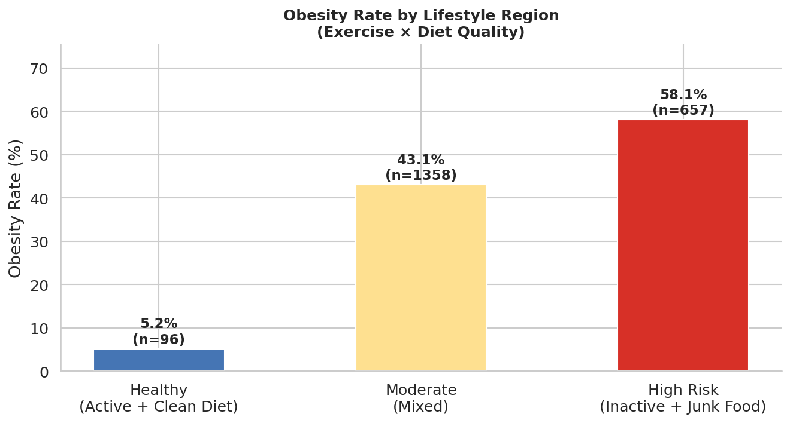

---

### 4.6 Screen Activity

**Why:**
TUE (screen time) alone has Spearman ρ = −0.076, essentially no predictive signal. The dangerous pattern is not high screen time alone — it is high screen time COMBINED with low exercise. A person who watches TV 6 hours/day but also goes to the gym is different from a person who does neither. The interaction of TUE and FAF identifies the fully sedentary digital lifestyle that neither feature captures alone.

**Formula:**
```python
def screen_activity(row):
    if row["TUE_int"] > 1 and row["FAF_int"] < 1:   return 2  # High Risk
    if row["TUE_int"] < 2 and row["FAF_int"] >= 2:  return 0  # Low Risk
    return 1                                                     # Balanced

df["screen_activity"] = df.apply(screen_activity, axis=1)
```

**Category definitions:**

| Value | Condition | Profile |
|-------|-----------|---------|
| 0 | TUE < 2h/day AND FAF ≥ 2 days/week | Low Risk — active and low screen use |
| 1 | Everything else | Balanced |
| 2 | TUE > 1h/day AND FAF < 1 day/week | High Risk — sedentary digital lifestyle |

**Example:**

| Person | FAF_int | TUE_int | screen_activity | Profile |
|--------|---------|---------|:---------------:|---------|
| A | 3 | 0 | **0** | Low Risk — exercises daily, rarely uses screens |
| B | 1 | 1 | **1** | Balanced — moderate exercise and moderate screens |
| C | 0 | 2 | **2** | High Risk — no exercise, 4+ hours on screens daily |

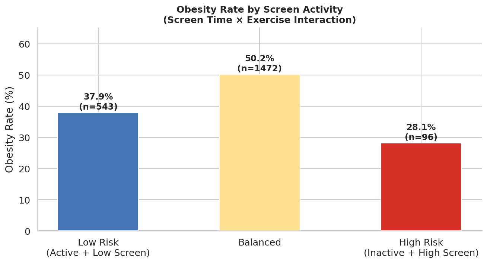

---

### 4.7 Risk Quadrant — Genetics × Exercise

**Why:**
Family history (genetic predisposition) and exercise interact in a clinically important way discovered during EDA:

- **With genetic risk:** regular exercise reduces obesity from 59.4% → 46.8% (−12.6 percentage points)
- **Without genetic risk:** exercise makes almost no difference (2.0% → 2.3%)

This means exercise is a meaningful intervention specifically for people with genetic risk, but nearly irrelevant for those without it. Neither `family_history_bin` nor `FAF_int` alone can express this interaction. Risk Quadrant encodes all four combinations directly.

**Formula:**
```python
def risk_quadrant(row):
    fam    = row["family_history_with_overweight_bin"]
    active = row["FAF_int"] >= 2
    if fam == 0 and active:      return 0  # No genetics + Active → Safest
    if fam == 1 and active:      return 1  # Genetics + Active   → Moderate
    if fam == 0 and not active:  return 2  # No genetics + Lazy  → Moderate
    return 3                                # Genetics + Inactive → Riskiest

df["risk_quadrant"] = df.apply(risk_quadrant, axis=1)
```

**Quadrant definitions with real obesity rates from data:**

| Value | family_history | Activity | Profile | Obesity Rate |
|-------|---------------|----------|---------|:------------:|
| 0 | No | Active (FAF ≥ 2) | Safest | 2.3% |
| 1 | Yes | Active (FAF ≥ 2) | Moderate | 46.8% |
| 2 | No | Inactive (FAF < 2) | Moderate | 2.0% |
| 3 | Yes | Inactive (FAF < 2) | Riskiest | 59.4% |

**Example:**

| Person | family_history_bin | FAF_int | risk_quadrant | Obesity Rate |
|--------|--------------------|---------|:-------------:|:------------:|
| A | 0 (no history) | 3 (active) | **0** | 2.3% |
| B | 1 (has history) | 3 (active) | **1** | 46.8% |
| C | 1 (has history) | 0 (inactive) | **3** | 59.4% |

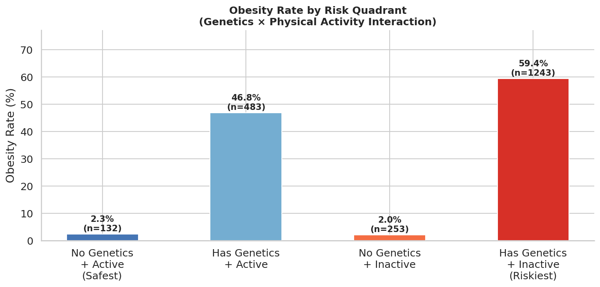

*Persons with genetic risk who exercise (Quadrant 1) have 12.6% lower obesity than those who don't (Quadrant 3). Without genetic risk, exercise makes almost no difference (2.0% vs 2.3%).*

---

### 4.8 Diet Type

**Why:**
Meal structure (NCP) and snacking (CAEC) together describe how a person organizes their eating. Someone who eats 1–2 meals with no snacking follows a structured/restrictive pattern. Someone with 4+ meals and constant snacking eats without structure. This classifies the overall eating pattern rather than measuring one dimension at a time.

**Formula:**
```python
def diet_type(row):
    if row["NCP_int"] <= 2 and row["CAEC_ord"] == 0:        return 0  # Structured
    if row["FAVC_bin"] == 0 and row["CAEC_ord"] <= 1:       return 1  # Controlled
    return 2                                                             # Uncontrolled

df["diet_type"] = df.apply(diet_type, axis=1)
```

**Category definitions:**

| Value | Condition | Type | Description |
|-------|-----------|------|-------------|
| 0 | NCP ≤ 2 AND CAEC = no | Structured | Few meals, no snacking — disciplined eating pattern |
| 1 | FAVC = no AND CAEC ≤ Sometimes | Controlled | Avoids junk, light snacking — managed but flexible |
| 2 | Everything else | Uncontrolled | High meals + frequent snacking + junk food |

**Example:**

| Person | NCP_int | CAEC_ord | FAVC_bin | diet_type | Type |
|--------|---------|----------|----------|:---------:|------|
| A | 2 | 0 | 0 | **0** | Structured — 2 meals, no snacking, no junk |
| B | 3 | 1 | 0 | **1** | Controlled — 3 meals, light snacking, no junk |
| C | 4 | 3 | 1 | **2** | Uncontrolled — 4 meals, constant snacking, junk food |

---

### 4.9 Active Transport

**Why:**
People who walk or cycle to work get 30–60 minutes of moderate cardiovascular exercise automatically every day without planning it as "exercise." This incidental physical activity is the most sustainable form because it requires no extra time or willpower. FAF measures deliberate exercise — `transport_active` captures habitual daily movement that FAF may not account for.

**Formula:**
```
transport_active = 1 if MTRANS ∈ {Walking, Bike} else 0
```

```python
df["transport_active"] = df["MTRANS"].isin(["Walking", "Bike"]).astype(int)
```

**Example:**

| Person | MTRANS | transport_active | Daily incidental activity |
|--------|--------|:---------------:|--------------------------|
| A | Walking | **1** | 30–60 min automatic walking every day |
| B | Bike | **1** | Cycling to school/work — cardio without gym |
| C | Automobile | **0** | Door-to-door, zero incidental movement |
| D | Public_Transportation | **0** | Some walking to stop but classified passive |

> **Note:** Only 56 people in the dataset walk (2.7% of total). The obesity rate for walkers is 5.4% vs 47–48% for car/transit users. The signal is strong but the sample is small — interpret with caution.

---

### 4.10 Exercise × Screen Interaction (FAF_x_TUE)

**Why:**
A person who exercises 3 days/week but also watches TV 6 hours/day is different from someone who exercises 3 days/week and barely uses screens. Multiplying FAF × TUE creates a direct interaction term that tree models would otherwise need multiple splits to capture. High FAF with high TUE produces a mid-range product; zero FAF with high TUE (the most sedentary profile) produces zero.

**Formula:**
```
FAF_x_TUE = FAF_int × TUE_int
```

```python
df["FAF_x_TUE"] = df["FAF_int"] * df["TUE_int"]
```

**Score range:** 0 to 6 (FAF max=3 × TUE max=2)

**Example:**

| Person | FAF_int | TUE_int | FAF_x_TUE | Profile |
|--------|---------|---------|:---------:|---------|
| A | 0 | 2 | **0** | Inactive + high screen — worst pattern |
| B | 3 | 0 | **0** | Active + low screen — best pattern |
| C | 2 | 1 | **2** | Moderate exercise with moderate screen use |
| D | 3 | 2 | **6** | Exercises heavily but also high screen use |

> **Note:** Both Person A (worst) and B (best) produce FAF_x_TUE = 0, so this feature works best in combination with `screen_activity` and `FAF_int` separately.

---

## Final Feature Set

After all preprocessing and feature engineering, the model trains on **27 features**.

> **Note:** `diet_type` is computed during feature engineering but is not included in the final training feature list. It was dropped because its information is largely captured by `caloric_risk`, `CAEC_ord`, and `FAVC_bin` already in the set.

### Complete Feature Table with Spearman ρ

| # | Feature | Group | Spearman ρ | Direction | Note |
|---|---------|-------|:----------:|-----------|------|
| 1 | `Age` | Continuous | +0.409 | Risk | Older → heavier; OB_III dips to 23.5y |
| 2 | `age_group` | Continuous | +0.417 | Risk | Life-stage buckets — stronger than raw Age |
| 3 | `FCVC_int` | SMOTE ordinal | +0.208 | ⚠ SMOTE reversed | Should be protective; FCVC=3 has 54.2% obese |
| 4 | `NCP_int` | SMOTE ordinal | −0.019 | ~zero | Meal count has no meaningful signal alone |
| 5 | `CH2O_int` | SMOTE ordinal | +0.138 | ⚠ SMOTE + reverse causality | Larger bodies need more water |
| 6 | `FAF_int` | SMOTE ordinal | −0.190 | Protective | Only OB_III drops dramatically (0.22) |
| 7 | `TUE_int` | SMOTE ordinal | −0.060 | ~zero | Screen time alone is not predictive |
| 8 | `family_history_with_overweight_bin` | Binary encoded | **+0.500** | **Strongest risk** | 55.9% vs 2.1% obesity — 54-point gap |
| 9 | `FAVC_bin` | Binary encoded | +0.250 | Risk | 51.1% vs 7.8% obesity — clear signal |
| 10 | `SMOKE_bin` | Binary encoded | +0.003 | ~zero | n=44 smokers only — unreliable |
| 11 | `SCC_bin` | Binary encoded | −0.195 | Protective | Calorie trackers: only 3.1% obese |
| 12 | `CAEC_ord` | Ordinal encoded | −0.353 | ⚠ SMOTE reversed | "Sometimes" (n=1765) bloated by SMOTE |
| 13 | `CALC_ord` | Ordinal encoded | +0.168 | Risk | Sometimes=51.3% vs no=37.1%; Always n=1 |
| 14 | `caloric_risk` | Engineered | +0.002 | ~zero | CAEC (−) and FAVC (+) cancel each other out |
| 15 | `health_score` | Engineered | +0.035 | ~zero | FAF (−) and FCVC/CH2O (+ SMOTE) cancel |
| 16 | `lifestyle_region` | Engineered | +0.226 | Risk | Inactive+junk food → higher class |
| 17 | `screen_activity` | Engineered | +0.082 | Risk | High screen + inactive → higher class |
| 18 | `risk_quadrant` | Engineered | **+0.369** | Risk | Best composite — genetics × exercise |
| 19 | `transport_active` | Engineered | −0.144 | Protective | Walkers 5.4% obese (but n=56 only) |
| 20 | `FAF_x_TUE` | Engineered | −0.079 | Weak protective | Direct multiplication — modest signal |
| 21 | `Gender_Female` | One-hot encoded | +0.037 | ~zero | Female 46.1% = Male 46.0% — identical |
| 22 | `Gender_Male` | One-hot encoded | −0.037 | ~zero | Mirror of Gender_Female |
| 23 | `MTRANS_Automobile` | One-hot encoded | −0.029 | ~zero | 45.1% obese (n=457) |
| 24 | `MTRANS_Bike` | One-hot encoded | −0.037 | ~zero | n=7 — statistically meaningless |
| 25 | `MTRANS_Motorbike` | One-hot encoded | −0.038 | ~zero | n=11 — statistically meaningless |
| 26 | `MTRANS_Public_Transportation` | One-hot encoded | +0.090 | Weak risk | 48.0% obese (n=1,580) |
| 27 | `MTRANS_Walking` | One-hot encoded | −0.139 | Protective | 5.4% obese (n=56 only) |

**Summary by group:**

| Group | Features | Count |
|-------|----------|:-----:|
| Continuous | `Age`, `age_group` | 2 |
| SMOTE-recovered ordinals | `FCVC_int`, `NCP_int`, `CH2O_int`, `FAF_int`, `TUE_int` | 5 |
| Binary encoded | `family_history_with_overweight_bin`, `FAVC_bin`, `SMOKE_bin`, `SCC_bin` | 4 |
| Ordinal encoded | `CAEC_ord`, `CALC_ord` | 2 |
| Engineered composites | `caloric_risk`, `health_score`, `lifestyle_region`, `screen_activity`, `risk_quadrant`, `transport_active`, `FAF_x_TUE` | 7 |
| One-hot encoded | `Gender_Female`, `Gender_Male`, `MTRANS_Walking`, `MTRANS_Bike`, `MTRANS_Motorbike`, `MTRANS_Public_Transportation`, `MTRANS_Automobile` | 7 |
| **Total** | | **27** |

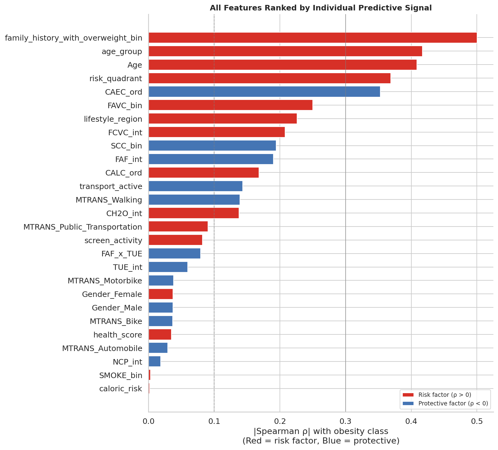

*Red bars = risk factors (ρ > 0). Blue bars = protective factors (ρ < 0). ⚠ = SMOTE-reversed direction — do not interpret clinically.*

**Why some engineered composites have near-zero ρ:**

`caloric_risk` (ρ = +0.002) and `health_score` (ρ = +0.035) appear useless by individual correlation, but this is because their components have opposing SMOTE-reversed signals that cancel out (e.g., CAEC is −0.353 and FAVC is +0.250 inside `caloric_risk`). However, tree-based models find non-linear splits — a feature can contribute meaningfully to the model even with near-zero Spearman ρ. The ablation study in the modeling chapter confirms the true contribution of each feature.